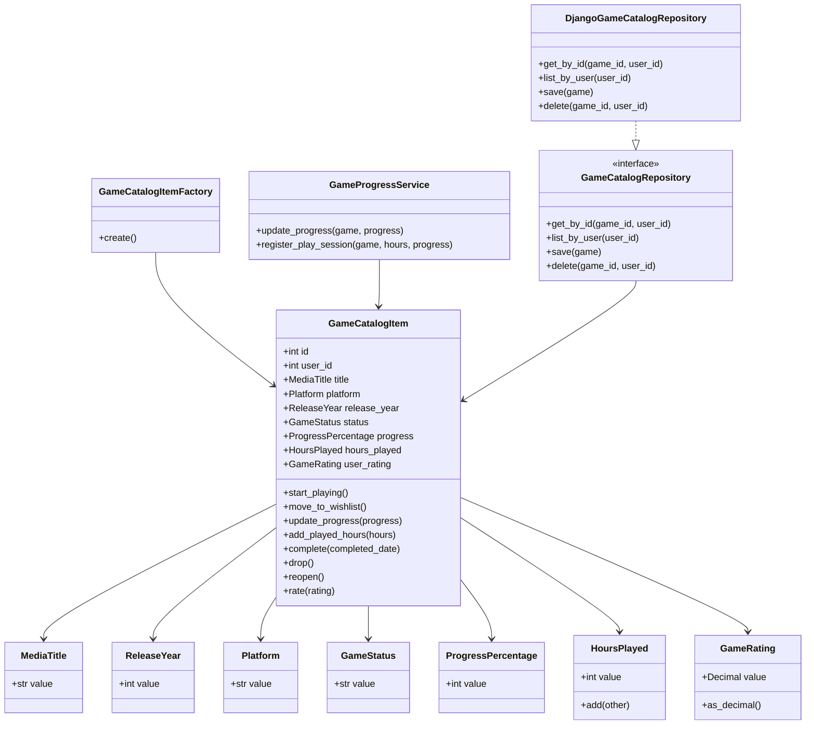

# Entrega Final do Projeto

## 1. Identificação do projeto

- Nome do projeto: **Katalog / Media Vault**
- Integrantes do grupo: **preencher com os nomes dos integrantes antes da submissão**
- Link do repositório: **preencher com o link final do repositório do grupo**
- Tecnologia utilizada: **Python, Django, Django REST Framework, React, SQLite/PostgreSQL, pytest**
- Funcionalidade principal desenvolvida: **gerenciamento do ciclo de vida de jogos no catálogo pessoal do usuário**

## 2. Descrição do case

O Katalog/Media Vault é um sistema de catálogo pessoal para organizar mídias consumidas pelo usuário, especialmente filmes e jogos. O recorte evoluído nesta entrega foi o módulo de jogos, pois ele possui regras de negócio claras: cadastrar um jogo, acompanhar status, registrar progresso, somar horas jogadas, avaliar a experiência e concluir o item do catálogo.

A proposta de negócio é evitar que o catálogo seja apenas um CRUD. O sistema deve impedir estados inválidos, como concluir um jogo sem avaliação pessoal, marcar um jogo como concluído sem progresso total ou manter data de conclusão em um jogo que ainda está em andamento.

## 3. Estado do projeto antes da análise externa

Antes da refatoração externa, o projeto estava organizado principalmente por apps Django tradicionais:

```text
backend/
 ├── apps/
 │   ├── games/
 │   ├── movies/
 │   ├── ratings/
 │   └── users/
 ├── media_vault/
 └── tests/
```

A maior parte das regras ficava próxima de `models`, `serializers` e `views`. Essa organização funcionava para CRUD, mas deixava as regras centrais do domínio dependentes da estrutura técnica do Django e dificultava a separação entre regra de negócio, aplicação e infraestrutura.

## 4. Alterações realizadas pelo outro grupo

As principais alterações recebidas na refatoração externa foram:

- criação da camada `domain`;
- criação da camada `application`;
- criação da camada `infrastructure`;
- definição da Entity/Aggregate Root `GameCatalogItem`;
- criação dos Value Objects `Platform`, `GameStatus`, `ProgressPercentage`, `HoursPlayed` e `GameRating`;
- reaproveitamento dos Value Objects compartilhados `MediaTitle` e `ReleaseYear`;
- criação da Factory `GameCatalogItemFactory`;
- criação da interface `GameCatalogRepository`;
- criação da implementação `DjangoGameCatalogRepository` fora do domínio;
- atualização de parte da API de jogos para passar pelos Use Cases;
- criação de testes de domínio para o ciclo de vida de jogos;
- documentação inicial do modelo DDD em `backend/docs/DOMAIN_MODEL_DDD.md`.

## 5. Avaliação das alterações recebidas

### Alterações mantidas

Foram mantidas as camadas `domain`, `application` e `infrastructure`, pois elas melhoram o isolamento do domínio e aproximam o projeto dos padrões táticos de DDD. Também foram mantidos `GameCatalogItem`, os Value Objects, a Factory, o Repository e os Use Cases.

### Alterações modificadas

A política de progresso foi ajustada. O `GameProgressService` existia, mas estava muito próximo de um simples repasse para a Entity. A versão final mantém o serviço, porém adiciona a operação `register_play_session`, que representa melhor uma ação real do domínio: registrar uma sessão de jogo com horas jogadas e progresso opcional.

Também foi ajustada a regra de conclusão. A versão final passa a impedir que um jogo seja concluído sem avaliação pessoal. Essa decisão alinha o código ao modelo original da atividade, em que uma mídia finalizada deve possuir nota/avaliação.

### Alterações rejeitadas

Não foi ampliado o DDD completo para filmes, usuários e ratings, pois isso aumentaria o escopo sem necessidade para a entrega. O recorte de jogos foi mantido como módulo principal para evitar complexidade artificial.

## 6. Melhorias adicionais realizadas pelo grupo original

Após a análise das alterações recebidas, foram realizadas as seguintes melhorias:

- proteção explícita da regra: jogo concluído exige avaliação pessoal;
- ajuste do método `complete` para impedir conclusão sem nota;
- ajuste de `update_progress` para impedir conclusão indireta sem avaliação;
- criação do fluxo de sessão de jogo por meio de `RegisterPlaySessionDTO` e `RegisterPlaySessionUseCase`;
- criação do endpoint `PATCH /api/games/{id}/register_session/`;
- ampliação dos testes automatizados de domínio e API;
- atualização da documentação final da entrega;
- atualização da dependência `psycopg2-binary` para versão compatível com Python 3.13;
- limpeza da entrega final, removendo caches, `__pycache__`, `.pytest_cache`, `node_modules` e arquivos `__MACOSX`.

## 7. Linguagem Ubíqua

| Termo | Significado no domínio |
|---|---|
| Catálogo | Biblioteca pessoal do usuário para organizar mídias |
| Jogo | Item de mídia cadastrado no catálogo pessoal |
| Item de catálogo | Registro individual de um jogo pertencente a um usuário |
| Plataforma | Ambiente onde o jogo é jogado, como PC, PS5, Xbox ou Switch |
| Progresso | Percentual de avanço do usuário no jogo |
| Horas jogadas | Tempo acumulado dedicado ao jogo |
| Sessão de jogo | Registro de tempo jogado e possível avanço de progresso |
| Status do jogo | Situação atual do jogo no catálogo |
| Wishlist | Jogo desejado, ainda não iniciado |
| Jogando | Jogo iniciado e ainda em andamento |
| Completado | Jogo finalizado pelo usuário |
| Abandonado | Jogo interrompido pelo usuário |
| Avaliação pessoal | Nota atribuída pelo usuário ao jogo |
| Data de conclusão | Data em que o jogo foi marcado como completado |

## 8. Módulos

### `domain/catalog/games`

Responsável pelo núcleo do domínio de jogos no catálogo.

Classes principais:

- `GameCatalogItem`
- `Platform`
- `GameStatus`
- `ProgressPercentage`
- `HoursPlayed`
- `GameRating`
- `GameCatalogItemFactory`
- `GameProgressService`
- `GameCatalogRepository`

### `domain/shared`

Contém conceitos compartilhados do domínio.

Classes principais:

- `DomainException`
- `MediaTitle`
- `ReleaseYear`

### `application/catalog/games`

Coordena casos de uso sem conter regra central do negócio.

Classes principais:

- `CreateGameUseCase`
- `UpdateGameUseCase`
- `UpdateGameProgressUseCase`
- `RegisterPlaySessionUseCase`
- `RateGameUseCase`
- DTOs de entrada dos casos de uso

### `infrastructure/persistence`

Implementa persistência concreta com Django ORM.

Classes principais:

- `DjangoGameCatalogRepository`

### `apps/games`

Camada de API/apresentação do Django REST Framework.

Classes principais:

- `Game`
- `GameSerializer`
- `GameViewSet`

## 9. Entities

### `GameCatalogItem`

- Identidade: `id` do item de catálogo.
- Responsabilidades: controlar status, progresso, horas jogadas, avaliação pessoal e data de conclusão.
- Comportamentos: `start_playing`, `move_to_wishlist`, `update_progress`, `add_played_hours`, `complete`, `drop`, `reopen`, `rate`.
- Regras de negócio:
  - wishlist não pode possuir progresso ou horas jogadas;
  - jogo concluído deve possuir progresso 100;
  - jogo concluído deve possuir data de conclusão;
  - jogo concluído deve possuir avaliação pessoal;
  - jogo abandonado não recebe progresso ou horas sem ser retomado;
  - data de conclusão só pode existir em jogos concluídos.
- Ciclo de vida: wishlist, jogando, completado, abandonado, reaberto.
- Justificativa: é uma Entity porque possui identidade própria e muda de estado ao longo do tempo. Dois jogos com os mesmos dados não representam necessariamente o mesmo item do catálogo.

## 10. Value Objects

### `MediaTitle`

- Atributos: `value`.
- Validações: não pode ser vazio e deve ter no máximo 200 caracteres.
- Regras protegidas: título obrigatório do item de catálogo.
- Critério de igualdade: igualdade baseada no texto normalizado.
- Justificativa: não possui identidade própria.

### `ReleaseYear`

- Atributos: `value`.
- Validações: deve ser inteiro, não pode ser anterior a 1950 e não pode estar muito distante no futuro.
- Regras protegidas: ano de lançamento válido.
- Critério de igualdade: igualdade pelo ano.
- Justificativa: representa um valor temporal do domínio.

### `Platform`

- Atributos: `value`.
- Validações: deve pertencer ao conjunto permitido: `pc`, `ps4`, `ps5`, `xbox-one`, `xbox-series`, `switch`, `mobile`.
- Regras protegidas: plataforma reconhecida pelo catálogo.
- Critério de igualdade: igualdade pelo valor normalizado.
- Justificativa: plataforma é um conceito de valor, sem ciclo de vida próprio.

### `GameStatus`

- Atributos: `value`.
- Validações: deve ser `wishlist`, `playing`, `completed` ou `dropped`.
- Regras protegidas: status conhecido pelo domínio.
- Critério de igualdade: igualdade pelo valor normalizado.
- Justificativa: representa o estado atual do jogo.

### `ProgressPercentage`

- Atributos: `value`.
- Validações: deve ser inteiro entre 0 e 100.
- Regras protegidas: progresso percentual válido.
- Critério de igualdade: igualdade pelo número inteiro.
- Justificativa: percentual de progresso não possui identidade própria.

### `HoursPlayed`

- Atributos: `value`.
- Validações: deve ser inteiro e não pode ser negativo.
- Regras protegidas: horas jogadas não negativas.
- Critério de igualdade: igualdade pela quantidade de horas.
- Justificativa: representa uma medida acumulada.

### `GameRating`

- Atributos: `value`.
- Validações: pode ser nulo, mas quando informado deve estar entre 0 e 5.
- Regras protegidas: avaliação pessoal válida.
- Critério de igualdade: igualdade pelo valor decimal.
- Justificativa: representa uma nota, sem identidade própria.

## 11. Aggregates e Aggregate Roots

### Aggregate: `GameCatalogItem`

- Aggregate Root: `GameCatalogItem`.
- Objetos internos: `MediaTitle`, `ReleaseYear`, `Platform`, `GameStatus`, `ProgressPercentage`, `HoursPlayed`, `GameRating`.
- Fronteira de consistência: status, progresso, horas, avaliação e data de conclusão pertencem ao mesmo Aggregate porque precisam mudar de forma coordenada.
- Invariantes:
  - progresso sempre entre 0 e 100;
  - horas jogadas nunca negativas;
  - wishlist sempre sem progresso e sem horas;
  - jogo completado sempre com progresso 100;
  - jogo completado sempre com data de conclusão;
  - jogo completado sempre com avaliação pessoal;
  - data de conclusão inexistente fora de `completed`.
- Operações controladas pela raiz: iniciar, mover para wishlist, atualizar progresso, adicionar horas, concluir, abandonar, reabrir e avaliar.
- Objetos fora do Aggregate: `User`, autenticação, permissões, perfil do usuário, filmes e ratings genéricos.
- Justificativa da modelagem: a raiz garante que elementos externos não alterem diretamente partes internas do jogo e não criem estados inconsistentes.

## 12. Factories

### `GameCatalogItemFactory`

- Objeto criado: `GameCatalogItem`.
- Regras aplicadas:
  - cria Value Objects a partir dos dados brutos;
  - define progresso 100 quando o status inicial é `completed`;
  - define data atual quando o jogo nasce como `completed`;
  - impede wishlist com progresso ou horas;
  - impede completed sem avaliação pessoal;
  - impede título, plataforma, progresso, horas, ano e avaliação inválidos.
- Justificativa: a criação do Aggregate envolve múltiplos objetos e invariantes que não deveriam ficar espalhados na API ou no ORM.

## 13. Domain Services

### `GameProgressService`

- Operação principal: `register_play_session(game, hours, progress=None)`.
- Justificativa: uma sessão de jogo combina horas jogadas, possível avanço de progresso e política de status. Ela representa uma ação da linguagem do negócio, não apenas um setter.
- Motivo para não ficar somente em uma Entity: a sessão de jogo é uma operação que pode evoluir para considerar histórico, metas, estatísticas e políticas externas ao estado interno imediato do Aggregate.
- Dependência de infraestrutura: nenhuma.

## 14. Repositories

### Interface: `GameCatalogRepository`

- Aggregate persistido: `GameCatalogItem`.
- Métodos: `get_by_id`, `list_by_user`, `save`, `delete`.
- Localização: `backend/domain/catalog/games/repositories.py`.

### Implementação concreta: `DjangoGameCatalogRepository`

- Localização: `backend/infrastructure/persistence/django_game_catalog_repository.py`.
- Responsabilidade: converter entre o model Django `Game` e o Aggregate `GameCatalogItem`.
- Separação: a interface pertence ao domínio; o Django ORM fica apenas na infraestrutura.

## 15. Regras de negócio

| Regra de negócio | Classe responsável | Forma de proteção |
|---|---|---|
| Título obrigatório | `MediaTitle` | Validação no `__post_init__` |
| Título com limite de 200 caracteres | `MediaTitle` | Validação no `__post_init__` |
| Ano de lançamento válido | `ReleaseYear` | Validação no `__post_init__` |
| Plataforma permitida | `Platform` | Conjunto `ALLOWED` |
| Status permitido | `GameStatus` | Conjunto `ALLOWED` |
| Progresso entre 0 e 100 | `ProgressPercentage` | Validação no `__post_init__` |
| Horas jogadas não negativas | `HoursPlayed` | Validação no `__post_init__` |
| Avaliação entre 0 e 5 | `GameRating` | Validação decimal no `__post_init__` |
| Wishlist sem progresso e sem horas | `GameCatalogItem` | `_ensure_consistency` |
| Jogo concluído com progresso 100 | `GameCatalogItem` | `_ensure_consistency` e `complete` |
| Jogo concluído com data de conclusão | `GameCatalogItem` | `_ensure_consistency` e `complete` |
| Jogo concluído com avaliação pessoal | `GameCatalogItem` | `_ensure_consistency` e `complete` |
| Jogo abandonado não recebe progresso | `GameCatalogItem` | `update_progress` |
| Jogo abandonado não recebe sessão | `GameProgressService` | `register_play_session` |
| Persistência apenas da Aggregate Root | `GameCatalogRepository` | Interface focada em `GameCatalogItem` |

## 16. Aplicação de Supple Design

Foram aplicados os seguintes pontos:

- nomes mais alinhados à linguagem do domínio, como `register_play_session`, `ProgressPercentage` e `HoursPlayed`;
- interfaces reveladoras de intenção nos métodos da Entity;
- Value Objects imutáveis para impedir valores inválidos após a criação;
- encapsulamento das regras na Aggregate Root;
- separação entre aplicação, domínio e infraestrutura;
- redução de uso direto do ORM nos fluxos principais de jogos;
- remoção da ideia de serviço genérico e reforço do serviço como uma operação real do domínio.

## 17. Arquitetura final

```text
backend/
 ├── domain/
 │   ├── shared/
 │   └── catalog/games/
 ├── application/
 │   └── catalog/games/
 ├── infrastructure/
 │   └── persistence/
 ├── apps/
 │   ├── games/
 │   ├── movies/
 │   ├── ratings/
 │   └── users/
 ├── media_vault/
 └── tests/
```

### Domain

Contém regras de negócio, Entities, Value Objects, Factories, Domain Services e interfaces de Repository. Não depende de Django, banco, API ou interface.

### Application

Coordena os casos de uso. Recebe DTOs, carrega Aggregates pelo Repository, chama comportamentos do domínio e salva o resultado.

### Infrastructure

Implementa detalhes técnicos. O `DjangoGameCatalogRepository` usa o Django ORM para persistir e recuperar Aggregates.

### API / apresentação

A camada `apps/games` expõe endpoints DRF, valida entrada básica, cria DTOs e chama Use Cases. A API não deve conter as regras centrais do domínio.

## 18. Diagrama do modelo de domínio



## 19. Testes e validações realizadas

Funcionalidades testadas:

- listagem de jogos por usuário autenticado;
- busca de jogos por título ou descrição;
- filtro por plataforma;
- estatísticas de jogos;
- criação de jogo concluído sem avaliação sendo rejeitada;
- registro de sessão de jogo somando horas e atualizando progresso;
- validações de Value Objects;
- conclusão de jogo apenas com avaliação pessoal;
- bloqueio de progresso/horas em jogos abandonados;
- comportamento de wishlist, conclusão, progresso e avaliação.

Testes automatizados existentes:

- `backend/tests/test_domain_games.py`
- `backend/tests/test_api_games.py`
- `backend/tests/test_games.py`
- `backend/tests/test_api_movies.py`
- `backend/tests/test_movies.py`
- `backend/tests/test_ratings.py`
- `backend/tests/test_users.py`

Validações realizadas na versão final:

```bash
cd backend
python -m pip install -r requirements.txt
python -m pytest -q
python manage.py check
```

Resultado obtido:

```text
27 passed
System check identified no issues (0 silenced).
```

## 20. Instruções para execução

### Backend

```bash
cd backend
python -m venv venv
source venv/bin/activate
# No Windows: venv\Scripts\activate
python -m pip install -r requirements.txt
python manage.py migrate
python manage.py createsuperuser
python manage.py runserver
```

A API ficará disponível em:

```text
http://localhost:8000
```

### Testes

```bash
cd backend
python -m pytest -q
python manage.py check
```

### Frontend

```bash
cd frontend
npm install
npm start
```

### Docker

```bash
docker compose -f docker/docker-compose.yml up --build
```

### Variáveis de ambiente

O projeto possui arquivos `.env.example` na raiz e no backend. Por padrão, os testes usam SQLite em memória. Para PostgreSQL, configurar:

```text
DB_ENGINE=django.db.backends.postgresql
DB_NAME=nome_do_banco
DB_USER=usuario
DB_PASSWORD=senha
DB_HOST=localhost
DB_PORT=5432
```

## 21. Limitações e trabalhos futuros

- O DDD foi aplicado de forma completa apenas no recorte de jogos.
- Filmes, usuários e ratings ainda seguem uma organização mais próxima do CRUD tradicional do Django.
- O histórico detalhado de sessões de jogo ainda não é persistido como entidade própria.
- A avaliação global `rating` permanece como campo técnico do model e pode ser melhor modelada futuramente.
- O frontend ainda pode ser evoluído para consumir explicitamente os novos endpoints de domínio.
- O repositório final no GitHub deve receber commits separados e claros para refletir a evolução da entrega.

## 22. Conclusão

Durante os três entregáveis, o projeto evoluiu de uma aplicação organizada principalmente por apps técnicos para uma solução com um recorte de domínio mais expressivo. A versão final isola as principais regras do ciclo de vida de jogos na camada de domínio, aplica Entities com comportamento, Value Objects, Aggregate Root, Factory, Repository, Domain Service e Use Cases.

A refatoração externa foi validada criticamente, mantida onde fazia sentido e complementada onde ainda havia fragilidade. A entrega final protege regras importantes do negócio e deixa a arquitetura mais sustentável para futuras evoluções.

## Histórico de commits recomendado

Como esta versão foi preparada em arquivo `.zip`, o grupo deve aplicar as alterações no repositório final com commits separados. Sugestão de histórico:

```text
refactor: protect game catalog aggregate invariants
feat: add play session use case for games
test: add domain and api tests for game lifecycle
docs: document final DDD delivery
fix: update backend dependency compatibility
```
