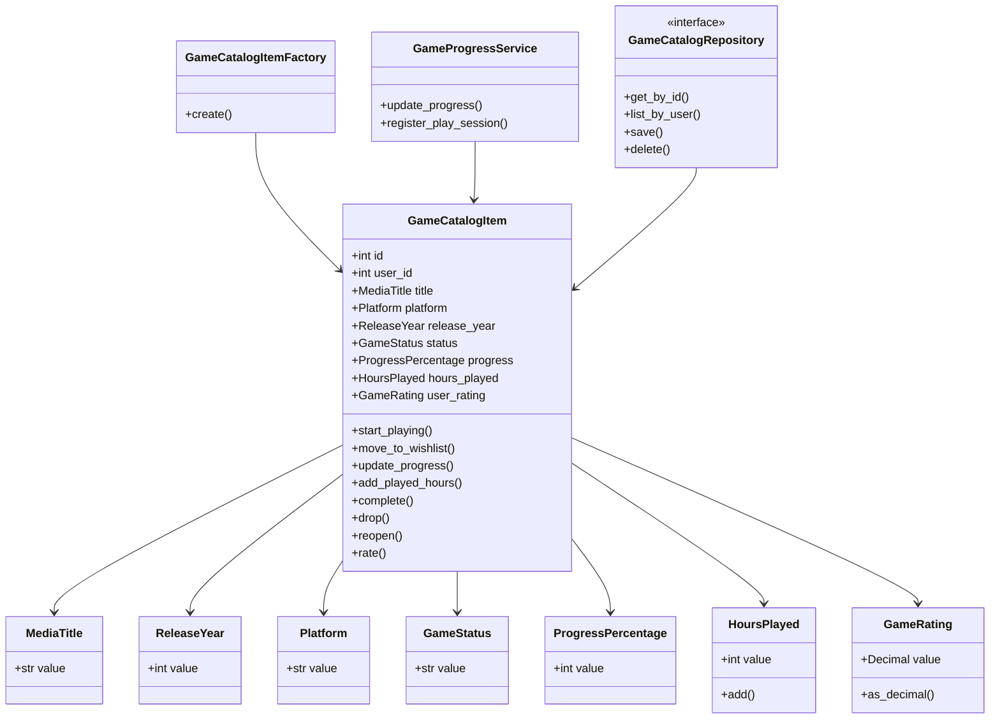

# Documentação do Modelo de Domínio - DDD

## 1. Descrição do case

O sistema Media Vault/Katalog permite que usuários mantenham um catálogo pessoal de filmes e jogos. Para a evolução com Domain-Driven Design, o recorte escolhido foi o **gerenciamento do ciclo de vida de jogos no catálogo pessoal do usuário**.

Esse recorte concentra regras reais do domínio: status do jogo, progresso, horas jogadas, avaliação pessoal, sessões de jogo e conclusão. A implementação evita tratar jogos apenas como CRUD e passa a representar comportamentos e invariantes do negócio.

## 2. Linguagem Ubíqua

| Termo | Significado no domínio |
|---|---|
| Catálogo | Biblioteca pessoal onde o usuário organiza suas mídias |
| Jogo | Item de mídia cadastrado no catálogo pessoal |
| Item de catálogo | Registro individual de um jogo pertencente a um usuário |
| Plataforma | Meio onde o jogo é jogado, como PC, PS5, Xbox ou Switch |
| Progresso | Percentual de avanço do usuário no jogo |
| Horas jogadas | Tempo acumulado dedicado ao jogo |
| Sessão de jogo | Registro de tempo jogado e avanço opcional de progresso |
| Status do jogo | Situação atual do jogo no catálogo |
| Wishlist | Jogo desejado para jogar futuramente |
| Jogando | Jogo iniciado e ainda em andamento |
| Completado | Jogo finalizado pelo usuário |
| Abandonado | Jogo interrompido pelo usuário |
| Avaliação pessoal | Nota atribuída pelo usuário ao jogo |
| Data de conclusão | Data em que o jogo foi marcado como completado |

## 3. Módulos

### `Catalog/Games`

Representa o gerenciamento de jogos dentro do catálogo pessoal do usuário.

Classes incluídas:

- `GameCatalogItem`
- `GameStatus`
- `Platform`
- `ProgressPercentage`
- `HoursPlayed`
- `GameRating`
- `GameCatalogItemFactory`
- `GameProgressService`
- `GameCatalogRepository`

Justificativa: essas classes estão agrupadas porque tratam do mesmo conceito de negócio: o ciclo de vida de um jogo cadastrado no catálogo pessoal.

### `Shared`

Contém conceitos reutilizáveis do domínio.

Classes incluídas:

- `DomainException`
- `MediaTitle`
- `ReleaseYear`

Justificativa: título e ano de lançamento são conceitos que podem ser reaproveitados por outros tipos de mídia.

## 4. Entity

### `GameCatalogItem`

Identidade: `id` do item de catálogo.

Responsabilidades:

- controlar status do jogo;
- controlar progresso;
- controlar horas jogadas;
- controlar avaliação pessoal;
- controlar data de conclusão;
- impedir estados inválidos.

Comportamentos:

- `start_playing()`;
- `move_to_wishlist()`;
- `update_progress(progress)`;
- `add_played_hours(hours)`;
- `complete(completed_date)`;
- `drop()`;
- `reopen()`;
- `rate(rating)`.

Regras de negócio:

- jogo em wishlist deve iniciar sem progresso e sem horas jogadas;
- jogo completado deve ter progresso 100;
- jogo completado deve possuir data de conclusão;
- jogo completado deve possuir avaliação pessoal;
- data de conclusão só pode existir em jogo completado;
- jogo abandonado não recebe progresso ou horas sem ser retomado.

Motivo para ser Entity: o jogo cadastrado possui identidade, ciclo de vida e mudança de estado. Dois jogos com os mesmos atributos não são necessariamente o mesmo item de catálogo.

## 5. Value Objects

### `MediaTitle`

Atributos: `value`.

Validações:

- não pode ser vazio;
- deve ter no máximo 200 caracteres.

Motivo para ser Value Object: não possui identidade própria. Dois títulos iguais representam o mesmo valor textual.

### `ReleaseYear`

Atributos: `value`.

Validações:

- deve ser inteiro;
- não pode ser anterior a 1950;
- não pode estar muito distante no futuro.

Motivo para ser Value Object: o ano é definido exclusivamente por seu valor.

### `Platform`

Atributos: `value`.

Validações:

- deve pertencer ao conjunto permitido: `pc`, `ps4`, `ps5`, `xbox-one`, `xbox-series`, `switch`, `mobile`.

Motivo para ser Value Object: plataforma não possui identidade própria no recorte escolhido.

### `ProgressPercentage`

Atributos: `value`.

Validações:

- deve ser inteiro;
- deve estar entre 0 e 100.

Motivo para ser Value Object: o progresso é definido pelo percentual informado.

### `HoursPlayed`

Atributos: `value`.

Validações:

- deve ser inteiro;
- não pode ser negativo.

Motivo para ser Value Object: horas jogadas são definidas por quantidade, sem identidade própria.

### `GameRating`

Atributos: `value`.

Validações:

- pode ser nulo;
- quando informado, deve estar entre 0 e 5.

Motivo para ser Value Object: a avaliação pessoal é definida pela nota, não por uma identidade.

### `GameStatus`

Atributos: `value`.

Validações:

- deve ser um dos status permitidos: `wishlist`, `playing`, `completed`, `dropped`.

Motivo para ser Value Object: representa o estado atual do jogo.

## 6. Aggregate

### `GameCatalogItem`

Aggregate Root: `GameCatalogItem`.

Objetos internos:

- `MediaTitle`;
- `ReleaseYear`;
- `Platform`;
- `GameStatus`;
- `ProgressPercentage`;
- `HoursPlayed`;
- `GameRating`.

Invariantes protegidas:

- progresso sempre entre 0 e 100;
- horas jogadas nunca negativas;
- wishlist não possui progresso nem horas jogadas;
- jogo completado sempre possui progresso 100;
- jogo completado sempre possui data de conclusão;
- jogo completado sempre possui avaliação pessoal;
- data de conclusão não existe fora do status completado.

Justificativa da fronteira do Aggregate: progresso, status, horas jogadas, avaliação e data de conclusão precisam mudar de forma controlada para manter a consistência do jogo no catálogo.

Objetos que ficaram fora do Aggregate: o usuário foi mantido apenas como `user_id`, pois autenticação, permissões e perfil pertencem a outro módulo do sistema.

## 7. Factory

### `GameCatalogItemFactory`

Objeto criado: `GameCatalogItem`.

Motivo para uso da Factory: a criação de um jogo envolve regras iniciais, como status, progresso, data de conclusão e validação dos Value Objects. A Factory impede que o Aggregate seja criado em estado inválido.

Regras aplicadas durante a criação:

- se o status inicial for `completed`, o progresso deve ser 100;
- se o status inicial for `completed` e não houver data, a data atual é usada;
- se o status for `wishlist`, progresso e horas jogadas devem ser 0;
- se o status for `completed`, deve haver avaliação pessoal;
- título, plataforma, ano, progresso, horas e avaliação são validados.

## 8. Domain Service

### `GameProgressService`

Operação principal: `register_play_session(game, hours, progress=None)`.

Regra de negócio representada: uma sessão de jogo soma horas jogadas e pode atualizar o progresso, respeitando o status atual do jogo.

Entidades/Value Objects envolvidos:

- `GameCatalogItem`;
- `ProgressPercentage`;
- `HoursPlayed`;
- `GameStatus`.

Motivo para não estar apenas dentro de uma Entity: uma sessão de jogo é uma operação de domínio que combina tempo, avanço e política de status. Ela pode evoluir futuramente para considerar histórico de sessões, metas e estatísticas sem tornar a Entity excessivamente grande.

Dependência de infraestrutura: nenhuma.

## 9. Repository

### `GameCatalogRepository`

Aggregate persistido: `GameCatalogItem`.

Operações disponíveis:

- `get_by_id(game_id, user_id)`;
- `list_by_user(user_id)`;
- `save(game)`;
- `delete(game_id, user_id)`.

Motivo para existir: a aplicação precisa recuperar e persistir jogos sem depender diretamente do Django ORM.

Implementação concreta: `DjangoGameCatalogRepository`, localizada em `infrastructure/persistence`.

## 10. Regras de negócio no domínio

| Regra de negócio | Classe onde foi implementada |
|---|---|
| Título do jogo não pode ser vazio | `MediaTitle` |
| Ano de lançamento deve ser válido | `ReleaseYear` |
| Plataforma deve ser permitida | `Platform` |
| Progresso deve estar entre 0 e 100 | `ProgressPercentage` |
| Horas jogadas não podem ser negativas | `HoursPlayed` |
| Avaliação deve estar entre 0 e 5 | `GameRating` |
| Status deve ser conhecido | `GameStatus` |
| Jogo completado deve ter progresso 100 | `GameCatalogItem` |
| Jogo completado deve ter data de conclusão | `GameCatalogItem` |
| Jogo completado deve ter avaliação pessoal | `GameCatalogItem` |
| Jogo em wishlist não pode ter progresso/horas | `GameCatalogItem` |
| Sessão de jogo deve respeitar status | `GameProgressService` |
| Persistência deve ocorrer pela Aggregate Root | `GameCatalogRepository` |

## 11. Casos de uso implementados

| Caso de uso | Responsabilidade |
|---|---|
| `CreateGameUseCase` | Criar um jogo usando a Factory e persistir pelo Repository. |
| `UpdateGameUseCase` | Atualizar dados gerais do jogo reconstruindo o Aggregate em estado válido. |
| `UpdateGameProgressUseCase` | Atualizar progresso por meio do `GameProgressService`. |
| `RegisterPlaySessionUseCase` | Registrar horas jogadas e progresso opcional por meio do Domain Service. |
| `RateGameUseCase` | Registrar avaliação pessoal usando o Value Object `GameRating`. |

## 12. Endpoints impactados

| Endpoint | Uso do domínio |
|---|---|
| `POST /api/games/` | Criação com `CreateGameUseCase` e `GameCatalogItemFactory`. |
| `PUT /api/games/{id}/` | Atualização completa com `UpdateGameUseCase`. |
| `PATCH /api/games/{id}/` | Atualização parcial com `UpdateGameUseCase`. |
| `PATCH /api/games/{id}/update_progress/` | Atualização de progresso com `UpdateGameProgressUseCase`. |
| `PATCH /api/games/{id}/register_session/` | Registro de sessão com `RegisterPlaySessionUseCase`. |
| `PATCH /api/games/{id}/rate/` | Avaliação com `RateGameUseCase`. |

Essa decisão evita que o update padrão do Django grave estados inconsistentes sem passar pela camada de domínio.

## 13. Decisões de modelagem e trade-offs

1. O domínio foi separado do Django ORM. O model `apps.games.models.Game` é tratado como modelo de persistência.
2. O Aggregate Root escolhido foi `GameCatalogItem`, pois ele controla as alterações do jogo no catálogo.
3. As validações de conceitos pequenos foram movidas para Value Objects.
4. A criação do jogo foi centralizada em uma Factory para impedir estados iniciais inválidos.
5. A infraestrutura converte entre o model Django e a entidade de domínio por meio do Repository concreto.
6. A camada de aplicação coordena casos de uso, mas não concentra as regras centrais do domínio.
7. Apenas o recorte de jogos foi evoluído para DDD para evitar complexidade desnecessária no restante do sistema.

## 14. Diagrama do modelo de domínio

